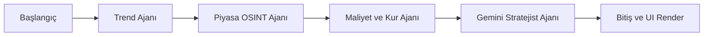

<div align="center">
  

  # Bedülonca SaaS V10.4

  ### Otonom Kâr Marjı Optimizasyonu ve Dinamik İş Zekası (BI) Ajanı
  *BTK Akademi, Google & Girvak AI Hackathon 2026 Projesi*

  [](https://www.python.org)
  [](https://streamlit.io)
  [](https://aistudio.google.com/)
  [](https://python.langchain.com/docs/langgraph/)
</div>

---

## 🚀 Proje Vizyonu

**Bedülonca**, e-ticaret satıcıları (KOBİ'ler ve Kurumsal İşletmeler) için özel olarak geliştirilmiş, **Google Gemini 2.5 API** ve **LangGraph** orkestrasyonuyla yönetilen otonom bir finans, strateji ve iş zekası (BI) platformudur.

E-ticaret pazarında faaliyet gösteren satıcıların, sadece rakiplerin fiyat dalgalanmalarına odaklanarak yaptıkları kontrolsüz indirimler; dinamik döviz kuru oynaklığı, platform komisyonları ve gizli depo/kargo maliyetleri birleştiğinde görünmez zararlara ("Kırmızı Çizgi" ihlali) yol açar. Bedülonca; anlık entegre edilen canlı döviz kuru akışları üzerinden **FIFO (First-In, First-Out)** yöntemiyle partisel gerçek stok maliyetini hesaplar, **Google Search OSINT** ile piyasa trendlerini (örneğin yaklaşan AAA oyunların donanım gereksinimlerini) tarar ve işletmeyi zarardan koruyarak otonom ticari kararlar (Smart Bundle, B2B Tasfiye, Kademeli İndirim, Fiyat Düzeltme) üretir.

---

## 🧠 Agentic Mimari (LangGraph StateGraph)

Sistem, paylaşılan ortak bir durum belleği (`AgentState`) üzerinden deterministik veri geçişleriyle birbirine pas atan **4 otonom ajan**dan oluşur:



| Ajan Sistemi | Operasyonel Görev Dağılımı & Algoritma |
| --- | --- |
| **Trend Ajanı** | Web crawler entegrasyonu simülasyonu ile piyasadaki donanım trendlerini, sistem gereksinimlerini (örn: GTA VI çıkışı) ve arz/talep dengesizliklerini tespit eder. |
| **Piyasa OSINT Ajanı** | Belirlenen SKU havuzunda Google Dorks (Cimri, Akakçe, Haberler) üzerinden rakip fiyatlarını ve pazar tabanını analiz ederek `market_news` logunu oluşturur. |
| **Maliyet ve Kur Ajanı (`cost_agent.py`)** | Canlı `open.er-api.com` döviz kuru API'sini tetikleyerek envanterdeki her partinin dolar bazlı alım maliyetini TL bazında FIFO yöntemiyle işler; amortisman ve komisyonları ekleyerek aşılması imkansız olan "Kırmızı Çizgiyi" belirler. |
| **Stratejist Ajan (`gemini-2.5-flash-lite`)** | Tüm ajanlardan gelen analitik veriyi sentezler; pazar kurallarına göre *Fiyat Düzeltme*, *Smart Bundle*, *Kademeli İndirim*, *Sepet Büyütücü Hediye*, *Tasfiye (B2B)* veya *Pozisyon Koru* kararlarını otonom olarak üretir. |

---

## 📊 Öne Çıkan Gelişmiş UI/UX Özellikleri (V10.4)

* **Filtrelerle %100 Senkronize Dinamik Grafik Motoru:** `main.py` içerisindeki tüm Plotly grafikleri (BCG Matrisi, Risk Scatter, Trend Çizgileri, Dönem Sonu Kâr Projeksiyonu) en üstteki Kategori, Dönem ve **"Trend Maks Ürün"** filtreleriyle anlık senkronize çalışır. Ürün sayısı kısıtlandığında grafikler en kârlı ürünlere göre anlık daralarak tam bir BI (Business Intelligence) deneyimi sunar.
* **Transparan WebM Animasyon Katmanları:** İşlem beklenirken (Yapay zeka analiz yaparken veya OSINT taraması sürerken), Streamlit'in standart ve sıkıcı yükleme çubukları yerine, `assets/` klasöründen Base64 ile encode edilerek çağrılan transparan arka planlı WebM animasyonları (`ai_thinking.webm`, `web_intel.webm`) chat balonunun ve durum panellerinin içinde yerel olarak oynatılır.
* **Kurumsal SaaS Arayüzü & Chrome Overrides:** Streamlit'in ham prototip görünümü CSS katmanlarıyla tamamen ezilmiştir; yan menü ve standart başlıklar iptal edilerek, yapay zeka model seçimlerinin yapıldığı terminal tasarımlı özel `pages/settings.py` ve derinlemesine inceleme sunan `pages/product_detail.py` sayfalarını içeren Sticky Top Navbar mimarisi kurulmuştur.
* **Kritik UI/UX ve Güvenlik Yamaları:** 
  - `st.metric` bileşenlerindeki inatçı alt satıra düşme problemi CSS Flexbox kurallarıyla ezilerek, "Zarar/Hatalı" kapsülleri sayının sağına kusursuzca kilitlenmiştir.
  - Ctrl+C kombinasyonunda Streamlit'in çıkardığı kronik "Clear Cache" modal pop-up pencereleri DOM düzeyinde enjekte edilen küresel JavaScript event listener'ları ile kalıcı olarak engellenmiştir.

---

## 🛠️ Teknoloji Yığını

* **Yapay Zeka Çekirdeği:** Google Gemini API (`gemini-2.5-flash-lite` / `gemini-2.5-pro` / `gemini-2.0-flash-exp`)
* **Ajan Orkestrasyonu:** LangChain & LangGraph Orchestrator
* **Veri & Analitik Görselleştirme:** Pandas, NumPy, Plotly Graph Objects (Dinamik Carousel Yapısı)
* **Arayüz Tasarımı:** Streamlit (Custom CSS, Flaticon UIcons Regular Rounded 2.6.0, WebM Base64 Video Streams)

---

## ⚙️ Kurulum ve Çalıştırma

Projenin yerel veya sunucu ortamında sorunsuz şekilde ayağa kalkabilmesi için aşağıdaki adımları sırasıyla takip edin:

```bash
# 1. Repoyu klonlayın
git clone https://github.com/kullaniciadi/bedulonca.git
cd bedulonca

# 2. Bağımlılıkları yükleyin
pip install -r requirements.txt

# 3. Ortam değişkenlerini (Environment Variables) yapılandırın
cp .env.example .env
# .env dosyasını bir metin editörü ile açarak kendi GEMINI_API_KEY bilginizi giriniz.

# 4. Uygulamayı başlatın
streamlit run main.py
```

---

## 📁 Kurumsal Proje Klasör Yapısı

```text
bedulonca/
├── main.py                  # BI Dashboard, Plotly Carousel ve LangGraph Tetikleyicisi
├── agent_graph.py           # LangGraph Node ve Edge Tanımlamaları
├── state.py                 # Multi-Agent TypeDict (AgentState) Belleği
├── pages/                   # Çoklu Sayfa (Multipage) Yönlendirmeleri
│   ├── product_detail.py    # SKU bazlı FIFO analizi, Zaman Serisi ve Guardrail Destekli Chatbot Modülü
│   └── settings.py          # Gemini Model seçimi ve CMD Rate Limit izleme terminali
├── agents/                  # İzole Edilmiş Ajan Mantıkları (Business Logic)
│   ├── cost_agent.py        # FIFO Stok hesaplama, Amortisman ve Kırmızı Çizgi algoritmaları
│   ├── market_news_agent.py # OSINT pazar tarayıcısı ve rakip fiyat entegrasyonu
│   └── strategist_agent.py  # Gemini karar mekanizması ve strateji şablonları
├── assets/                  # UI Varlıkları (Kurumsal Logolar ve Transparan WebM Animasyonları)
│   ├── logo.png
│   ├── ai_thinking.webm
│   ├── web_intel.webm
│   ├── chart_loader.webm
│   └── strategy_gen.webm
├── data/
│   └── mock_data.json       # Simüle edilmiş B2B pazar verileri, alım partileri ve geçmiş trendler
├── .env.example             # Çevresel değişken şablonu
├── .gitignore               # Git dışı bırakılacak dosyalar listesi
└── requirements.txt         # Projenin çalışması için kilitlenmiş kütüphane versiyonları
```

---

## 🎬 Demo Videosu

Sistemin otonom fiyat düzeltme, canlı kur ile FIFO hesaplama, BCG matris filtreleme ve Gemini destekli kurumsal chat operasyonlarını izlemek için:

👉 **[Tanıtım Videosunu Buradan İzleyebilirsiniz (YouTube / Drive)]**

---
